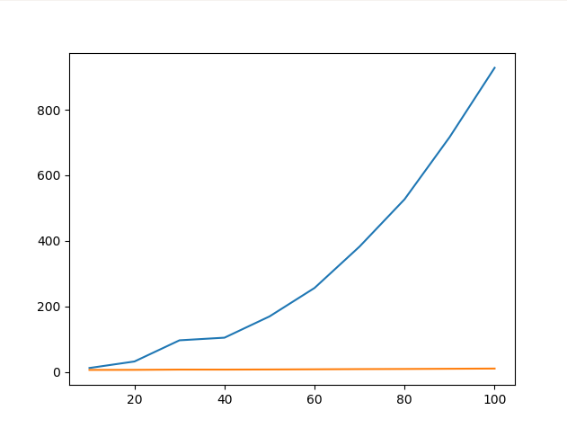

# Kilotron

## Description

This repository contains the code for the algorithm developed as part of the [KEAP | Kilobot's Evolutionary Algorithms in Python](https://github.com/steagsInc/Projet_Kilobots) during the first semester of 2020.

The purpose is to implement a neural network on a kilobot to make a swarm identify their shape. To do that we have based this programme on [Morphogenesis in robot swarms](https://github.com/Danixk/Turing_morphogenesis), so we have two molecules concentration circulating through the swarm, we removed the moving aspect and instead implemented a perceptron on each kilobolt. It takes the two molecules and a c number of communications values that come from his neighbours, then it gives out one prediction for each shape and c communications values that it sends to his neighbours.

Due to Covid-19 we had to work the project from home so the simulation were made on [Kilombo](https://github.com/JIC-CSB/kilombo), and so this software hasn't been tested on an actual kilobot.

## Kilotron Cuda

The time to run each simulation was getting exponentially high the bigger we made the neural networks. So to reduce it, we made an alternate program that uses the code library from NVIDIA. Which gives really appreciated the results.

the time in seconds, *kilotron cuda* in orange, *kilotron* in blue.

### Documentation

First of all, follow the [NVIDIA cuda doc](https://docs.nvidia.com/cuda/cuda-installation-guide-microsoft-windows/index.html) to have the appropriate environment.

The configuration turn around two files:

- The first is NN.txt located in the perceptron directory, each line has the value of a parameter of the neural network, with the corresponding label bellow.

- The second is weights.txt, each line is a weight of the perceptron. Both of these are loaded at the start of the simulator so no need to *make* between changes.

## Kilotron

Has I said due to Covid-19 we couldn't work with the real kilobots, so this version probably doesn't work has much as the other one.

I'm not sure that kilobots can hold files so I'm not sure that the way we store the weights is working right now.

### Documentation

All of the parameters are located in kilotron.h from line 26 to 30.
The structure in itself is located in kilotron.c line 755.
And the weights are stored in the weights.txt file
